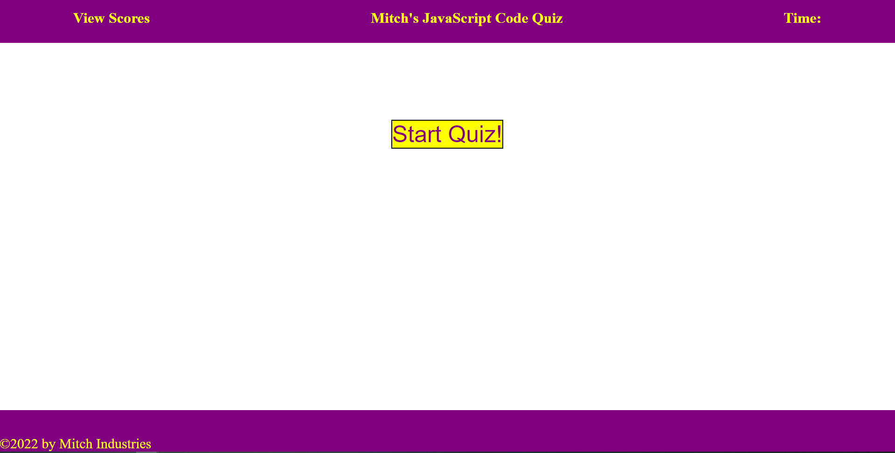
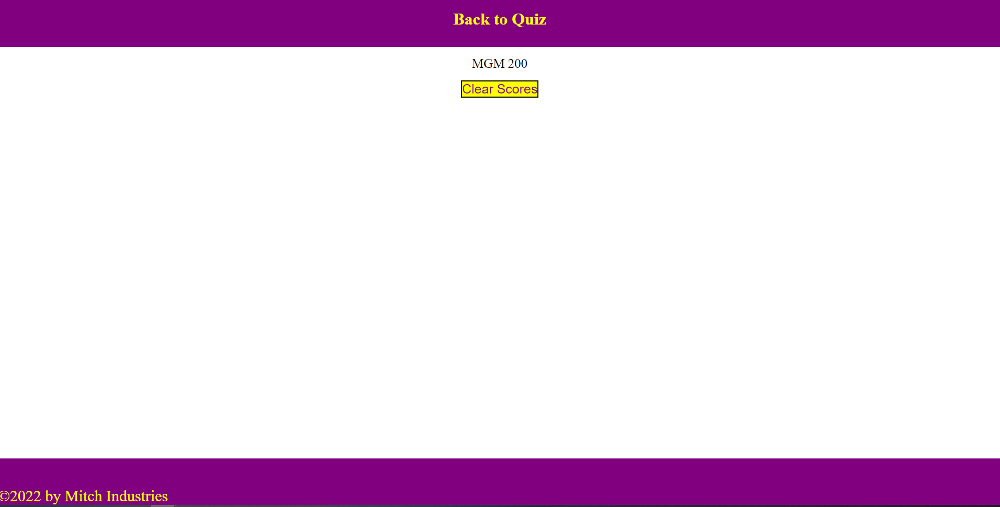

# JavaScript-Code-Quiz

# Project Description 

In the 4th challenge of the bootcamp, I set out to make myself a coding quiz. The quiz should have a timer, as well as the functionality to save high scores.  

# Installation 

To view the project, clone the git repository using VS Code. this will allow you to vie the index.html file ass well as the css style file. The website can be view by right clicking in the index.html file and opening via web browser. 

Link to deployed website: https://mitchgm.github.io/Mitch-Portfolio/ 

# Usage

 

# User Story

AS A coding boot camp student
I WANT to take a timed quiz on coding fundamentals that stores high scores
SO THAT I can gauge my progress compared to my peers

# Acceptance Criteria

GIVEN I am taking a code quiz
WHEN I click the start button
THEN a timer starts and I am presented with a question
WHEN I answer a question
THEN I am presented with another question
WHEN I answer a question incorrectly
THEN time is subtracted from the clock
WHEN all questions are answered or the timer reaches 0
THEN the game is over
WHEN the game is over
THEN I can save my initials and score

# Changelog

v1.0.0
--------------------------------
- created the readme file
- updated html to comply with semantic best practices
- updated html to optimize SEO and accessibility 
- updated css
- updated css and html to provide a better user experience
- created a repo on github
- fixed image pathing
- created javascript files

# License

Copyright (c) 2021 Mitch Marena 

Permission is hereby granted, free of charge, to any person obtaining a copy
of this software and associated documentation files (the "Software"), to deal
in the Software without restriction, including without limitation the rights
to use, copy, modify, merge, publish, distribute, sublicense, and/or sell
copies of the Software, and to permit persons to whom the Software is
furnished to do so, subject to the following conditions:

The above copyright notice and this permission notice shall be included in all
copies or substantial portions of the Software.

THE SOFTWARE IS PROVIDED "AS IS", WITHOUT WARRANTY OF ANY KIND, EXPRESS OR
IMPLIED, INCLUDING BUT NOT LIMITED TO THE WARRANTIES OF MERCHANTABILITY,
FITNESS FOR A PARTICULAR PURPOSE AND NONINFRINGEMENT. IN NO EVENT SHALL THE
AUTHORS OR COPYRIGHT HOLDERS BE LIABLE FOR ANY CLAIM, DAMAGES OR OTHER
LIABILITY, WHETHER IN AN ACTION OF CONTRACT, TORT OR OTHERWISE, ARISING FROM,
OUT OF OR IN CONNECTION WITH THE SOFTWARE OR THE USE OR OTHER DEALINGS IN THE
SOFTWARE.
